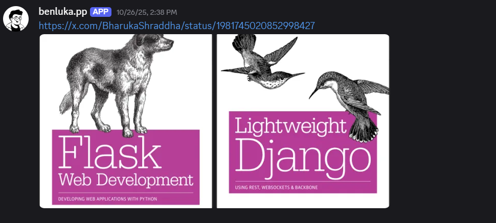

# Discord Twitter Media Archiver

> **Overview**
>
> A Discord bot that detects Twitter (X) links in messages, downloads all attached media and reuploads them to the same Discord channel. This preserves content in case it’s later removed from Twitter.



## ✨ Features

- Detects Twitter/X links in Discord messages.
- Downloads all attached media.
- Stores media locally for long-term preservation.
- Automatically re-uploads media to Discord.
- Simple configuration and lightweight setup.

## ⚙️ Setup

### Environment

Create a `.env` file containing your Discord bot token:

```
TOKEN='x.xxx.x'
```

### Installation

```bash
npm install
npm start
```

Your bot should now connect and begin monitoring messages for Twitter/X links.
